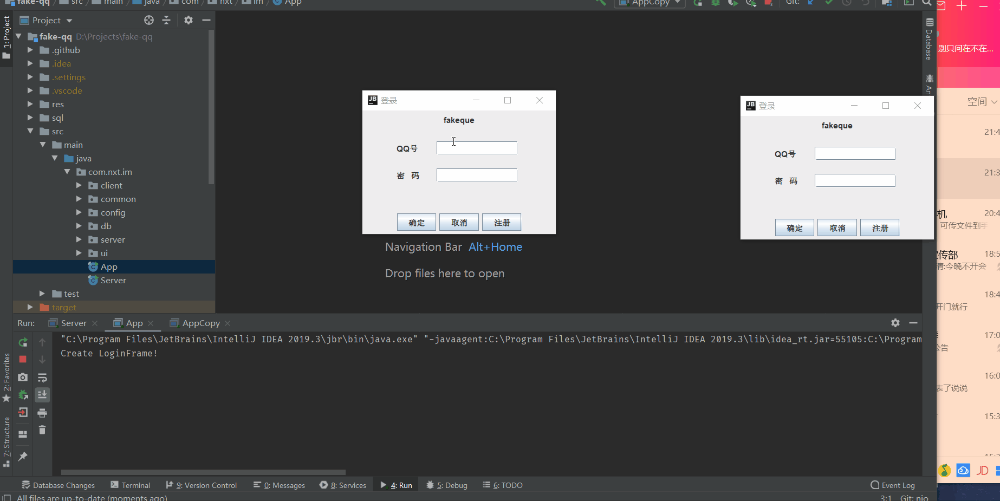

# fake-qq

## 一、概述

### 构建系统

基于 Gradle

### 实现技术

- Java NIO通信
- MySQL 关系型数据库
- Java Swing 图形界面编程
- JUnit 单元测试框架

### 结构

common        # 前后端共有信息

chat-server   # 消息的实时发送接受
http-server   # 登录注册等功能以及静态资源的处理

client # 客户端UI

### 预览

### 功能实现情况

- [ ] 文字聊天
- [ ] 图片发送
- [ ] 群聊
- [ ] Socket 通信会出现的问题： 掉线检测，身份获知，异常处理与垃圾回收，粘包，丢包，断开重连
